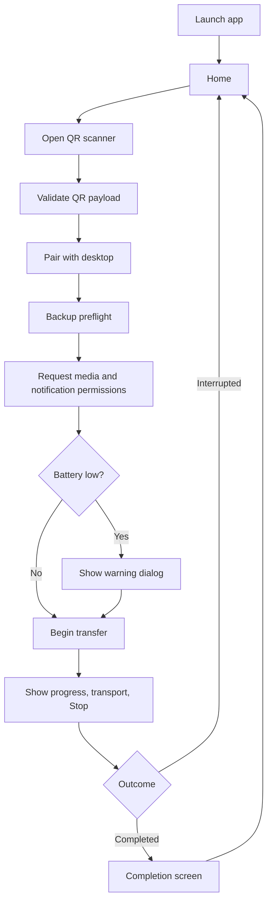

# Dev Design Spec: Mobile Folder (iOS Companion App)

Status: Draft v0.3 (iteration 3, simplified MVP flow)

## 1. Purpose

This document defines the mobile-side design for Mobile Folder, based on the mobile PRD, the desktop PRD and desktop dev spec, the mobile-folder roadmap, and the provided mobile UI mocks.

The concrete pairing contract now lives in the dedicated [pairing spec](./[dev]%20pairing.md).

## 3. MVP Detailed Design

### 3.1 MVP scope

The mobile MVP covers:

- This draft treats iOS as the only implementation target for now. Android stays in scope at the product level, but the first code cut and the detailed implementation notes below are intentionally iOS-specific.
- a home page that explains the app and the PC setup
- scan entry for desktop QR pairing
- a simplified bootstrap handshake against desktop QR payload
- permission handling for camera, media library, notifications, and low-battery warning flow
- full eligible-library backup only
- progress UI with transport state and Stop
- completion confirmation and return-to-home flow
- content-safe OpenTelemetry-based operational telemetry

### 3.2 MVP user-visible flow

### 3.3 MVP canonical mobile state model

The mobile app should expose these canonical user-visible states:

| State | Purpose | Persisted locally |
| --- | --- | --- |
| `home_idle` | First-time or zero-pending landing state | yes |
| `scanning_qr` | User is actively scanning or entering from QR | no |
| `pairing` | Bootstrap handshake in progress | pairing metadata only |
| `backup_preflight` | Paired and ready to request permissions or start backup | yes |
| `transferring` | Active transfer session | yes |
| `completed` | Desktop-confirmed success | last successful summary only |
| `failed` | Non-recoverable failure for the current session, e.g. desktop unreachable | yes |
| `cancelled` | User cancelled the backup | yes |

Important mapping rules:

- `paused`, `disconnected`, and `failed` must never be presented as success.
- `completed` is allowed only after explicit desktop confirmation.
- `home_resume` is derived from persisted last-known state plus last-known pending information.
- `disconnected` is a persisted recoverable state even though richer reconnect flows arrive later.

### 3.4 MVP runtime architecture

#### A. Composition root

Responsibilities:

- register service protocols in a single DI container
- create the root observable model
- keep preview, test, and production wiring separate

#### B. App flow model

Responsibilities:

- own the top-level route
- load persisted launch state
- translate service results into view state
- mediate transitions between home, scan, preflight, transfer, failure, and completion
- persist resumable UX metadata after meaningful transitions

#### C. Service layer

MVP service boundaries:

- `QRCodePayloadDecoding` for QR payload parsing
- `AppStateStore` for local persisted session snapshot
- `PairingService` for QR/bootstrap handshake
- `PermissionService` for media, notification, camera, and battery summaries
- `TransferService` for session start, stop, resume, and completion snapshots
- `TelemetryClient` for operational and health events through OpenTelemetry

#### D. UI layer

Responsibilities:

- render state-specific screens from immutable view data
- send actions back to the flow model
- keep explanation-heavy content on the home screen instead of in a separate onboarding flow
- avoid embedding business rules directly in view code

### 3.6 Local data model and persistence

The mobile app needs lightweight local persistence for UX recovery. MVP should store:

- `install_id`
- `device_uuid`
- `last_desktop_label` if allowed by privacy rules
- `last_session_id`
- `last_route_category`
- `last_interruption_reason`
- `last_known_pending_count`
- `last_successful_backup_time`
- `last_permission_scope`
- `last_transfer_snapshot`

For the initial implementation, a serialized app snapshot in local preferences is sufficient. That keeps MVP small and is enough to restore:

- what the last visible transfer or interruption state was
- the last-known pending or completed summary
- the last-known permission scope

### 3.7 MVP service contracts

#### A. QR payload decoder

Responsibilities:

- decode the scanned QR payload
- parse a universal-link-style URL in the format `https://dl.boldman.net?<query...>`
- use Foundation `URLComponents` and `URLQueryItem`
- reject invalid host names or missing required fields before pairing begins

#### B. Pairing service

Responsibilities:

- accept a simplified QR payload model
- validate schema version
- create or reuse This Machine identity
- perform bootstrap handshake with desktop
- return pairing result containing desktop display label, session ID, trust result, and chosen transport

#### C. Permission service

Responsibilities:

- report camera access state for scanner entry
- request media-library access only when backup is about to begin
- report battery level bucket and charging state for the pre-transfer warning

#### D. Transfer service

Responsibilities:

- start transfer after pairing and just-in-time permission checks
- expose current counts, ETA if available, failed-item count, and active transport
- stop safely when the user requests Stop
- finalize only after desktop confirms completion

Current MVP transport slice:

- export accessible PhotoKit assets one at a time to temporary files
- upload each asset over LAN to the paired desktop using the trusted desktop record from pairing
- ask desktop to mark the session complete once the current upload batch finishes

#### E. App state store

Responsibilities:

- load launch snapshot on app start
- save snapshot after pairing success, stop, interruption, resume, and completion
- keep stored payload small and content-safe

#### F. Telemetry client

Responsibilities:

- emit usage and health events through OpenTelemetry
- keep instrumentation and exporter setup out of view code
- avoid media content and human-readable device names
- distinguish user stop from transport or system failure

### 3.8 Screen design

#### A. Home

Home is the first and primary explanation surface. It must cover:

- what the app does
- that v1 backs up the full eligible local library only
- that pairing and transfer are local-only and desktop-driven
- the PC setup steps
- that notification permission is requested when backup begins
- that telemetry uses OpenTelemetry and remains content-safe
- the correct CTA for first-time, pending, or resumable sessions

#### B. Scan and pairing

This surface must handle:

- camera-based scan entry
- QR-expired recovery messaging
- active pairing progress
- clear explanation that camera permission is only requested when the scanner is actually opened

#### C. Backup preflight

This surface replaces a heavier permission flow. It must:

- summarize backup readiness
- show current media scope
- surface incomplete-library messaging
- trigger the low-battery dialog if needed just before transfer starts

#### D. Transfer

This surface must show:

- active transport
- completed item count
- pending count
- failed-item count
- ETA when reliable
- USB-is-faster guidance
- Stop action with a confirmation dialog

#### E. Interrupted and recovery

This surface must distinguish:

- cancelled by user
- Wi-Fi lost
- desktop unreachable

#### F. Completion

This surface must:

- show desktop-confirmed success
- remind the user that already transferred items may still be indexing on desktop
- provide a clean path back to home

### 3.9 Simplified QR payload contract

The QR contract is now defined in the dedicated [pairing spec](./[dev]%20pairing.md).

Key update from the earlier draft:

- keep the 6-digit `opt` value for QR bootstrap
- keep the QR payload to `v`, `ept`, `sid`, and `opt`
- allow `ept` to advertise up to five filtered LAN endpoint targets so the phone can retry across multi-network desktops

This keeps the MVP contract small while still scoping the QR payload strictly to pairing bootstrap.

### 3.11 Permissions and battery flow

- request **camera** permission when the live scanner is about to open

Low-battery policy:

- evaluate battery state after the user commits to starting backup
- if the device is below threshold and not charging, show a modal warning dialog
- allow the user to continue anyway

### 3.12 Notifications and telemetry

Telemetry:

- implement through OpenTelemetry, not a custom analytics layer
- keep instrumentation centralized behind `TelemetryClient`
- use a production exporter later, while the initial scaffold can use a development-safe exporter

Event coverage should include:

- scan started, scan succeeded, scan failed
- pairing started, pairing succeeded, pairing rejected, pairing timed out
- backup started, resumed, stopped, completed, abandoned
- transport bucket
- permission category
- low-battery warning shown and continued
- interruption category

Telemetry must not include:

- media bytes
- filenames
- album names
- full paths
- exact asset identifiers
- human-readable device names

### 3.13 Media enumeration and pending count

When the real iOS implementation lands, it should use `PHPhotoLibrary` and related Photos APIs with these rules:

- enumerate the full eligible local photo and video library
- exclude hidden items, recently deleted items, and cloud placeholders that are not resident on device
- allow limited-library transfer only with explicit incomplete-backup messaging
- prefer progressive enumeration so first transfer does not wait for a full-library pre-scan

### 3.14 Transfer, interruption, and resume

MVP transfer semantics:

- Start only after pairing succeeds and the just-in-time permission flow completes.
- Stop means stop sending additional items as soon as safely possible.
- Stop does not imply that desktop indexing stops for items already transferred.

### 3.15 MVP testing plan

Minimum validation for the mobile slice:

- unit tests for launch routing from persisted snapshot
- unit tests for home-state transitions
- unit tests for low-battery warning gating
- unit tests for stop-to-resume behavior
- unit tests for simplified QR payload decoding
- manual validation later for QR scan, permission timing, limited-library messaging, interruption, and completion flows on real devices

## 4. Phase 2 Design Direction

High-level additions:

- initial USB transport support behind the existing transport boundary
- automatic USB preference when a supported connection appears during an active session