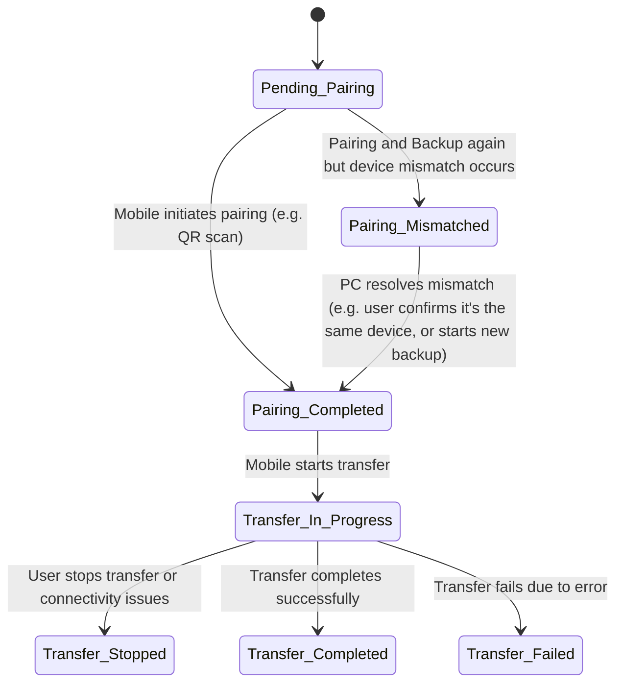
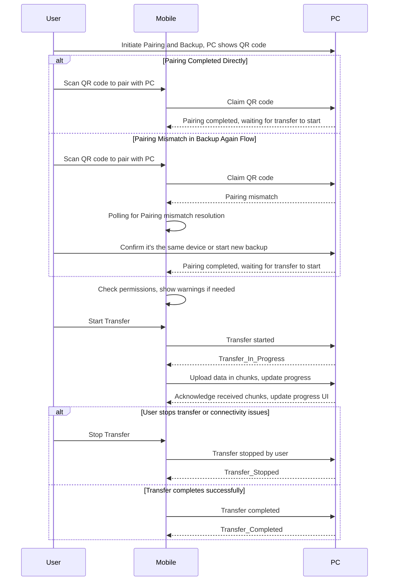

Backup State Machine
The backup process can be modeled as a state machine with the following states:
1. Pending_Pairing: PC is waiting for mobile initiate pairing, e.g. via QR scan.
2. Pairing_Completed: PC/Mobile pair is set up correctly. PC is now waiting for mobile to start the transferring process. Mobile can do permissions check and show warnings before allowing user before starting the transfer.
3. Transfer_In_Progress: Transfer process has started and is ongoing.
4. Transfer_Stopped: User has stopped the transfer mid-way through, or transfer was interrupted due to connectivity issues. PC should show option to resume transfer when mobile is back online.
5. Transfer_Completed: Transfer process has completed successfully.
6. Transfer_Failed: Transfer process has failed due to an error.
7. Pairing_Mismatched: In 'Back Up Again' flow, mobile device id does not match the folder. PC should show error and recovery options (e.g. retry pairing, start new backup, etc.)

Transitions between states:

Sequence diagram for backup process:
