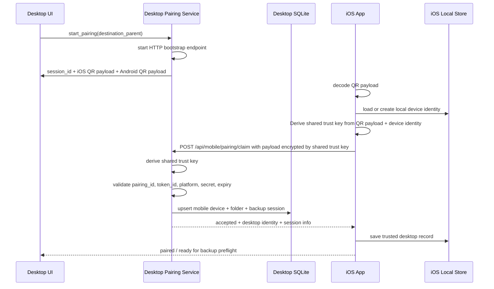

# Dev Design Spec: Pairing

Status: Draft v0.1 (MVP initial implementation)

## 1. Purpose

This document defines the concrete MVP pairing contract shared by the desktop app and the iOS companion app.

It refines and partially supersedes the earlier high-level pairing notes in:

- [PC mobile-folder spec](./[dev][pc]-3-mobile-folder.md)
- [iOS mobile-folder spec](./[dev][mobile]-4-mobile-folder.md)
- [trust model](./[dev]%20trust%20model.md)
- [service discovery spec](./[dev]%20service%20discovery.md)

The goal of this iteration is **initial pairing only**:

- desktop creates and owns the pairing intent
- mobile scans or pastes the QR payload and claims the intent
- both sides persist trust material produced by pairing
- auto-resume without QR remains out of scope until discovery and reconnect work lands later

## 2. MVP decisions

### 2.1 Desktop remains authoritative

Desktop owns:

- pairing intent creation
- QR expiry and refresh
- pairing acceptance or rejection
- stable desktop folder resolution
- trust-record persistence for the mobile device

Mobile owns:

- local device identity generation and persistence
- QR decoding
- bootstrap request submission
- local trusted-desktop persistence

### 2.2 Use a high-entropy bootstrap secret, not a 6-digit code

The earlier mobile spec proposed a 6-digit `opt` value in the QR payload. This implementation replaces that with a high-entropy one-time `secret`.

Reason:

- the QR is machine-scanned, not manually typed
- the bootstrap endpoint is reachable over the local network
- a 6-digit secret is too weak for LAN-exposed pairing bootstrap

If product later wants a human-verification step, that can be added as a separate confirmation code without weakening the transport bootstrap secret.

### 2.3 Derive and persist a shared pairing key now

The desktop and mobile app derive the same symmetric key from:

- pairing schema identifier
- pairing ID
- token ID
- QR bootstrap secret
- mobile device UUID
- mobile platform
- desktop server nonce
- desktop device ID

MVP stores that derived key as trust material for later reconnect work. MVP does **not** yet use the key to encrypt the LAN transfer channel; that remains Phase 5 transport hardening work.

## 3. Lifecycle

1. Desktop user chooses **Add Folder -> Mobile Device**.
2. Desktop user chooses the parent destination folder.
3. Desktop starts a short-lived local HTTP bootstrap endpoint and creates a pairing intent.
4. Desktop renders separate Android and iOS QR codes. Each QR encodes the same desktop endpoint but a distinct platform token and secret.
5. Mobile scans or pastes the QR payload.
6. Mobile validates the QR payload locally and sends a bootstrap claim request to desktop.
7. Desktop validates pairing ID, token ID, platform match, secret, and expiry.
8. Desktop derives trust material, creates or reuses the mobile folder, persists trust/session metadata, and returns an acceptance response.
9. Mobile derives the same trust key from the desktop response and persists the trusted desktop record.
10. Mobile advances to the existing preflight / permission flow.

## 4. Sequence diagram



## 5. Contracts

### 5.1 QR payload

The QR value is a universal-link-style URL:

`https://dl.boldman.net?<query...>`

Query fields:

- `v`: schema version, currently `1`
- `ept`: `192.168.50.12:38933` (desktop local server host and port)
- `sid`: desktop pairing intent / session ID
- `opt`: high-entropy one-time bootstrap secret


### 5.2 Mobile -> desktop bootstrap claim

`POST /api/mobile/pairing/claim`

```json
{
  "schema": 1,
  "sid": "pairing-123",
  "opt": "high-entropy-secret",
  "platform": "ios",
  "device_uuid": "ios-device-001",
  "device_name": "Alice iPhone",
  "install_id": "install-001"
}
```

Desktop validates:

- schema match
- active pairing session exists
- sid matches
- opt exists on the active session
- platform matches requested platform
- opt matches
- no other device already consumed the session

NOTE: payload is encrypted by the derived trust key

### 5.3 Desktop acceptance response

```json
{
  "schema": 1,
  "status": "accepted",
  "message": "Pairing accepted for Alice iPhone. Desktop is ready for LAN transfer.",
  "session_id": "pairing-123",
  "desktop_device_id": "desktop-device-001",
  "desktop_name": "Studio Mac",
  "device_uuid": "ios-device-001",
  "transport": "lan",
  "paired_at": "2026-04-10T06:00:05+00:00"
}
```

Failure responses use the same schema and include:

- `status`: `rejected` or `expired`
- `message`: user-facing recovery guidance

Recommended HTTP status mapping:

- `200` accepted
- `400` malformed request
- `403` bad secret
- `404` no active session / unknown token
- `409` already-consumed or platform mismatch
- `410` expired

## 6. Persistence

### 6.1 Desktop

Desktop persists:

- `app_config.mobile_pairing_desktop_device_id`
- `mobile_devices`
  - `device_uuid`
  - `platform`
  - `device_name`
  - `trust_key_b64`
  - `paired_at`
  - `last_seen_at`
- `mobile_folders`
  - `folder_id`
  - `device_uuid`
  - `transfer_state`
  - `transfer_state_updated_at`
- `mobile_backup_sessions`
  - `session_id`
  - `device_uuid`
  - `folder_id`
  - `status`
  - `started_at`
  - `paired_at`

Folder reuse rule:

- if the same `device_uuid` pairs again, desktop reuses the existing `mobile_folders` row and existing root folder path
- if a new device name would collide with an existing sibling folder, desktop appends a short device UUID suffix

### 6.2 iOS

iOS persists:

- `install_id`
- `device_uuid`
- trusted desktop record containing:
  - `desktop_device_id`
  - `desktop_name`
  - `endpoint_url`
  - `mobile_device_uuid`
  - `shared_key_base64`
  - `transport`
  - `last_session_id`
  - `paired_at`

The current iteration also keeps the existing launch snapshot model so the home and transfer UX can still be restored independently of pairing trust state.

## 7. Error handling and UX

- Expired QR before request: mobile shows **QR expired** immediately.
- Expired QR at desktop: desktop returns `expired`; mobile shows the desktop-provided retry guidance.
- Invalid secret or mismatched session: mobile shows **Pairing failed** with retry guidance.
- Accepted pairing: mobile shows desktop name, transport, and session ID before moving to preflight.
- Desktop pairing dialog continues polling current pairing result while open and shows the resolved folder on success.

## 8. Initial implementation slice

This iteration implements:

- desktop-side live pairing bootstrap service
- desktop-side QR payload rewrite to the universal-link contract above
- desktop-side SQLite persistence for paired devices, folders, and sessions
- iOS-side QR decoder update to the same contract
- iOS-side real bootstrap networking, trust-key derivation, and trusted desktop persistence
- a real iOS app target at `mobile/ios/AlbumTransporterApp.xcodeproj`
- a paste-based pairing UI until live camera scanning lands

This iteration intentionally does **not** implement:

- actual file transfer after pairing
- automatic reconnect without QR
- service discovery resume
- transport-layer encryption with the derived trust key
- Android client implementation

## 9. Follow-on work

- wire the accepted pairing session into transfer workers
- add explicit desktop-side mismatch and already-paired UX
- add service-discovery-based resume using the persisted trust records
- upgrade key derivation and transport protection in Phase 5
