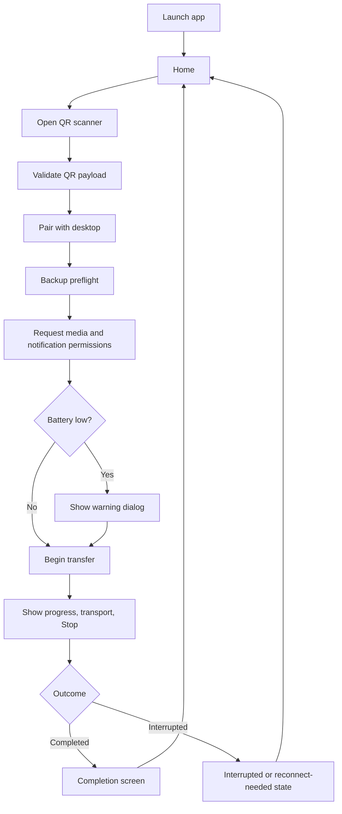

# Dev Design Spec: Mobile Folder (iOS Companion App)

Status: Draft v0.3 (iteration 3, simplified MVP flow)

## 1. Purpose

This document defines the mobile-side design for Mobile Folder, based on the mobile PRD, the desktop PRD and desktop dev spec, the mobile-folder roadmap, and the provided mobile UI mocks.

This iteration intentionally simplifies the first mobile draft:

- There is **no dedicated onboarding page** in MVP.
- The **home page is the landing page** and must explain what the app does, what v1 includes, how desktop pairing works, and the key privacy or telemetry disclosures.
- The MVP section below is detailed and actionable.
- Later roadmap phases remain high-level and additive.
- The initial code in `mobile/ios` is still intentionally minimal, but it now matches the simpler flow more closely.

## 2. Current Baseline In Repo

The current repository already establishes several important constraints:

- The desktop app remains the session authority for Add Folder, QR generation, pairing acceptance, destination-folder resolution, and indexing of received files.
- The desktop-side dev spec already defines the MVP contract as QR bootstrap plus Wi-Fi LAN transfer, with USB, reconnect, discovery, and stronger trust work staged later.
- The mobile-side starter note required two core engineering choices:
  - SwiftUI for iOS client development.
  - DI for better modularity and testability with a mature Swift DI framework.
- The `mobile/ios` folder was effectively empty before this work.
- UI references are available in `dt_image_search/prompt/ui-mobile-folder`, but this revision intentionally collapses the old onboarding concepts into a clearer home page.

This matters because the mobile design should stay aligned with the desktop contract and should not invent a second authority for pairing, folder resolution, or completion state.

The concrete pairing contract now lives in the dedicated [pairing spec](./[dev]%20pairing.md). When this document and the desktop spec previously diverged on QR fields or bootstrap details, the pairing spec is the source of truth.

## 3. Guiding Design Decisions

### 3.1 Core decisions

- **SwiftUI is the presentation layer.** Use modern SwiftUI APIs with an iOS 17 baseline so the app can use `NavigationStack`, `@Observable`, and current alert and navigation patterns.
- **Use Factory for DI.** Factory is a mature Swift DI framework with compile-time-safe registrations and lightweight SwiftUI integration. The container should stay at the composition root; views should receive concrete view data and action closures instead of resolving dependencies ad hoc.
- **Desktop remains authoritative.** The mobile app owns QR entry, device identity persistence, permission requests, media enumeration, transfer UX, and resumable local state. The desktop decides whether a session is accepted, where files land, and whether the session is new, repeat, resumable, or mismatched.
- **MVP transport is QR bootstrap plus Wi-Fi LAN only.** The mobile architecture must still keep transport behind an interface so USB, reconnect, and discovery can be added later without rewriting the feature flow.
- **MVP backup scope is full eligible library only.** The app does not support album selection, folder selection, desktop-to-mobile sync, or delete sync in v1.
- **Permissions are just-in-time.** Camera permission is requested when the live QR scanner is about to open. Media-library permission is requested when the user taps **Start Backup**. Local-notification permission is also requested when **Start Backup** is tapped, because the app may need to notify about completion or interruption during a long transfer.
- **Low-battery is a modal warning, not a full screen.** If battery is low and the phone is not charging, show a dialog immediately before transfer begins.
- **Persist only what the mobile app needs to recover UX.** Device UUID, last known desktop or session context, last visible transfer state, last pending summary, and last interruption category should be stored locally. Media content metadata beyond what is needed for resumability should not be persisted on mobile in MVP.
- **Views stay thin; services own behavior.** Permission checks, QR payload parsing, pairing bootstrap, transfer orchestration, pending-count refresh, and persistence belong in services and observable models, not inside view bodies.
- **Telemetry must use OpenTelemetry.** The app records operational and health telemetry through an OpenTelemetry SDK, and telemetry must remain content-safe.

### 3.2 Library and SDK choices

Use mature libraries where they clearly simplify self-contained functionality:

- **QR capture**: prefer a maintained library such as `CodeScanner` rather than building a custom AVFoundation surface from scratch in the first production iteration.
- **Telemetry**: use `opentelemetry-swift-core` as the base SDK integration, with OTLP export layered in when the real backend wiring lands.
- **QR payload parsing**: use Foundation `URLComponents` and `URLQueryItem` rather than adding a parsing library. The QR value is a universal-link-style URL, so built-in URL parsing is the simplest mature option.

### 3.3 Simplified MVP stance

This draft treats iOS as the only implementation target for now. Android stays in scope at the product level, but the first code cut and the detailed implementation notes below are intentionally iOS-specific.

### 3.4 What the initial code still does not attempt yet

The initial code added in this iteration does **not** implement:

- real QR capture through a camera surface
- real deep-link continuation from system camera or App Store
- actual `PHPhotoLibrary` enumeration
- actual LAN or USB transport
- production OTLP exporter wiring
- production persistence backend

Instead, it introduces the composition root, the simpler screen and state model, the protocol boundaries, a simplified QR payload shape, and a concrete OpenTelemetry-backed telemetry wrapper.

## 4. MVP Detailed Design

### 4.1 MVP scope

The mobile MVP covers:

- a home page that explains the app and the PC-first setup
- scan entry for desktop QR pairing
- local device identity creation and persistence
- a simplified bootstrap handshake against desktop QR payload
- permission handling for camera, media library, notifications, and low-battery warning flow
- full eligible-library backup only
- progress UI with transport state and Stop
- interruption and reconnect-needed messaging
- Resume Backup behavior after incomplete sessions
- completion confirmation and return-to-home flow
- content-safe OpenTelemetry-based operational telemetry

The mobile MVP explicitly does not require:

- a dedicated onboarding flow
- initial USB transport
- automatic reconnect without QR
- service discovery
- device mismatch resolution UX
- stronger end-to-end transport encryption beyond the MVP trust model
- guaranteed background completion while suspended by iOS

### 4.2 MVP user-visible flow

1. The user opens the app and lands directly on the home page.
2. The home page explains what the app does, the PC-first steps, the backup scope, and the key privacy or telemetry disclosures.
3. The user taps **Scan Desktop QR**.
4. The app requests camera permission only when the live scanner is about to open.
5. The app scans the desktop QR code or resumes from an equivalent deep link.
6. The app validates the simplified QR payload and begins pairing with desktop.
7. After desktop accepts pairing, the app shows a lightweight preflight screen.
8. When the user taps **Start Backup**, the app requests media-library and local-notification permissions.
9. If battery is low and the phone is not charging, the app shows a low-battery dialog immediately before transfer begins.
10. The app begins incremental backup and shows progress, active transport, and Stop.
11. If the session is interrupted, the app preserves enough local state to show **Resume Backup** on the next launch.
12. When desktop confirms completion, the app shows a completion screen and then returns to the home state with updated backup metadata.



### 4.3 MVP canonical mobile state model

The mobile app should expose these canonical user-visible states:

| State | Purpose | Persisted locally |
| --- | --- | --- |
| `home_idle` | First-time or zero-pending landing state | yes |
| `home_resume` | Prior incomplete or pending state with Resume CTA | yes |
| `scanning_qr` | User is actively scanning or entering from QR | no |
| `pairing` | Bootstrap handshake in progress | pairing metadata only |
| `backup_preflight` | Paired and ready to request permissions or start backup | yes |
| `transferring` | Active transfer session | yes |
| `paused` | User stop or OS pause | yes |
| `disconnected` | Desktop unreachable or reconnect needed | yes |
| `completed` | Desktop-confirmed success | last successful summary only |
| `failed` | Non-recoverable failure for the current session | yes |

Important mapping rules:

- `paused`, `disconnected`, and `failed` must never be presented as success.
- `completed` is allowed only after explicit desktop confirmation.
- `home_resume` is derived from persisted last-known state plus last-known pending information.
- `disconnected` is a persisted recoverable state even though richer reconnect flows arrive later.

### 4.4 MVP runtime architecture

#### A. Composition root

Responsibilities:

- register service protocols in a single DI container
- create the root observable model
- keep preview, test, and production wiring separate

Initial code path:

- `mobile/ios/Sources/AlbumTransporterKit/DI/Container+App.swift`

#### B. App flow model

Responsibilities:

- own the top-level route
- load persisted launch state
- translate service results into view state
- mediate transitions between home, scan, preflight, transfer, interruption, and completion
- persist resumable UX metadata after meaningful transitions

Initial code path:

- `mobile/ios/Sources/AlbumTransporterKit/App/MobileAppModel.swift`

#### C. Service layer

MVP service boundaries:

- `QRCodePayloadDecoding` for QR payload parsing
- `AppStateStore` for local persisted session snapshot
- `PairingService` for QR/bootstrap handshake
- `PermissionService` for media, notification, camera, and battery summaries
- `TransferService` for session start, stop, resume, and completion snapshots
- `TelemetryClient` for operational and health events through OpenTelemetry

Initial code paths:

- `mobile/ios/Sources/AlbumTransporterKit/Services/MobileAppServices.swift`
- `mobile/ios/Sources/AlbumTransporterKit/Services/DemoServices.swift`
- `mobile/ios/Sources/AlbumTransporterKit/Services/OpenTelemetryTelemetryClient.swift`

#### D. UI layer

Responsibilities:

- render state-specific screens from immutable view data
- send actions back to the flow model
- keep explanation-heavy content on the home screen instead of in a separate onboarding flow
- avoid embedding business rules directly in view code

Initial code paths:

- `mobile/ios/Sources/AlbumTransporterKit/App/AlbumTransporterRootView.swift`
- `mobile/ios/Sources/AlbumTransporterKit/Views/HomeView.swift`
- `mobile/ios/Sources/AlbumTransporterKit/Views/SupportViews.swift`

### 4.5 Initial iOS project structure

The first scaffold uses a Swift package so the architecture can be reviewed and unit-tested before a full Xcode app target is added.

```text
mobile/ios/
├── Package.swift
├── Sources/
│   └── AlbumTransporterKit/
│       ├── App/
│       │   ├── AlbumTransporterRootView.swift
│       │   ├── MobileAppDomain.swift
│       │   └── MobileAppModel.swift
│       ├── DI/
│       │   └── Container+App.swift
│       ├── Services/
│       │   ├── DemoServices.swift
│       │   ├── MobileAppServices.swift
│       │   └── OpenTelemetryTelemetryClient.swift
│       └── Views/
│           ├── HomeView.swift
│           └── SupportViews.swift
└── Tests/
    └── AlbumTransporterKitTests/
        └── MobileAppModelTests.swift
```

This remains sufficient for the first iteration because it demonstrates the intended layering and state transitions without prematurely committing to a full Xcode project or a production camera or transport stack.

### 4.6 Local data model and persistence

The mobile app needs lightweight local persistence for UX recovery. MVP should store:

- `install_id`
- `device_uuid`
- `last_desktop_label` if allowed by privacy rules
- `last_session_id`
- `last_route_category`
- `last_interruption_reason`
- `last_known_pending_count`
- `last_successful_backup_time`
- `last_permission_scope`
- `last_transfer_snapshot`

For the initial implementation, a serialized app snapshot in local preferences is sufficient. That keeps MVP small and is enough to restore:

- whether Resume Backup should be shown
- what the last visible transfer or interruption state was
- the last-known pending or completed summary
- the last-known permission scope

If later phases require richer checkpointing or asset-level local metadata, the mobile side can add SQLite or SwiftData then. MVP does not need that complexity yet.

### 4.7 MVP service contracts

#### A. QR payload decoder

Responsibilities:

- decode the scanned QR payload
- parse a universal-link-style URL in the format `https://dl.boldman.net?<query...>`
- use Foundation `URLComponents` and `URLQueryItem`
- reject invalid host names or missing required fields before pairing begins

#### B. Pairing service

Responsibilities:

- accept a simplified QR payload model
- validate schema version
- create or reuse local device identity
- perform bootstrap handshake with desktop
- return pairing result containing desktop display label, session ID, trust result, and chosen transport

#### C. Permission service

Responsibilities:

- report camera access state for scanner entry
- request media-library access only when backup is about to begin
- request local-notification access when **Start Backup** is tapped
- report battery level bucket and charging state for the pre-transfer warning

#### D. Transfer service

Responsibilities:

- start transfer after pairing and just-in-time permission checks
- expose current counts, ETA if available, failed-item count, and active transport
- stop safely when the user requests Stop
- resume from the last resumable marker
- finalize only after desktop confirms completion

#### E. App state store

Responsibilities:

- load launch snapshot on app start
- save snapshot after pairing success, stop, interruption, resume, and completion
- keep stored payload small and content-safe

#### F. Telemetry client

Responsibilities:

- emit usage and health events through OpenTelemetry
- keep instrumentation and exporter setup out of view code
- avoid media content and human-readable device names
- distinguish user stop from transport or system failure

### 4.8 Screen design

#### A. Home

Home is the first and primary explanation surface. It must cover:

- what the app does
- that v1 backs up the full eligible local library only
- that pairing and transfer are local-only and desktop-driven
- the PC-first steps
- that notification permission is requested when backup begins
- that telemetry uses OpenTelemetry and remains content-safe
- the correct CTA for first-time, pending, or resumable sessions

#### B. Scan and pairing

This surface must handle:

- camera-based scan entry
- QR-expired recovery messaging
- active pairing progress
- clear explanation that camera permission is only requested when the scanner is actually opened

#### C. Backup preflight

This surface replaces a heavier permission flow. It must:

- summarize backup readiness
- show current media scope
- clarify that notification permission is requested when **Start Backup** is tapped
- surface incomplete-library messaging
- trigger the low-battery dialog if needed just before transfer starts

#### D. Transfer

This surface must show:

- active transport
- completed item count
- pending count
- failed-item count
- ETA when reliable
- USB-is-faster guidance
- Stop action with a confirmation dialog

#### E. Interrupted and recovery

This surface must distinguish:

- paused by user
- paused by OS or backgrounding
- Wi-Fi lost
- desktop unreachable
- reconnect required

#### F. Completion

This surface must:

- show desktop-confirmed success
- remind the user that already transferred items may still be indexing on desktop
- provide a clean path back to home

### 4.9 Simplified QR payload contract

The QR contract is now defined in the dedicated [pairing spec](./[dev]%20pairing.md).

Key update from the earlier draft:

- keep the 6-digit `opt` value for QR bootstrap
- keep the QR payload to `v`, `ept`, `sid`, and `opt`
- allow `ept` to advertise up to five filtered LAN endpoint targets so the phone can retry across multi-network desktops
- keep platform out of the payload because mobile still sends platform in the claim request

This keeps the MVP contract small while still scoping the QR payload strictly to pairing bootstrap.

### 4.10 Libraries and SDKs in the production implementation

Recommended choices for the real iOS implementation:

- **QR scanning**: `CodeScanner`
- **Telemetry**: `opentelemetry-swift-core` with OTLP export added in production wiring
- **Payload parsing**: Foundation `URLComponents` and `URLQueryItem`

Rule:

- Prefer a mature external library when it meaningfully removes bespoke infrastructure.
- Prefer built-in Foundation APIs when they already solve the problem well.

### 4.11 Permissions and battery flow

Just-in-time permission policy:

- request **camera** permission when the live scanner is about to open
- request **media-library** permission when **Start Backup** is tapped
- request **local-notification** permission when **Start Backup** is tapped

Low-battery policy:

- evaluate battery state after the user commits to starting backup
- if the device is below threshold and not charging, show a modal warning dialog
- allow the user to continue anyway

This is simpler than dedicating a full screen to low-battery handling and better matches the moment of actual user intent.

### 4.12 Notifications and telemetry

Notifications:

- request local-notification permission when backup is about to start
- send local notification on completion
- send local notification when transfer is interrupted or needs reconnect, when the OS permits it

Telemetry:

- implement through OpenTelemetry, not a custom analytics layer
- keep instrumentation centralized behind `TelemetryClient`
- use a production exporter later, while the initial scaffold can use a development-safe exporter

Event coverage should include:

- scan started, scan succeeded, scan failed
- pairing started, pairing succeeded, pairing rejected, pairing timed out
- backup started, resumed, stopped, completed, abandoned
- transport bucket
- permission category
- low-battery warning shown and continued
- interruption category

Telemetry must not include:

- media bytes
- filenames
- album names
- full paths
- exact asset identifiers
- human-readable device names

### 4.13 Media enumeration and pending count

When the real iOS implementation lands, it should use `PHPhotoLibrary` and related Photos APIs with these rules:

- enumerate the full eligible local photo and video library
- exclude hidden items, recently deleted items, and cloud placeholders that are not resident on device
- allow limited-library transfer only with explicit incomplete-backup messaging
- prefer progressive enumeration so first transfer does not wait for a full-library pre-scan
- compute or refresh pending count without presenting stale values as final

Pending-count behavior:

- show last-known pending count immediately if available
- refresh the count once local metadata and desktop session reachability are revalidated
- label the count as incomplete when permission scope is limited

### 4.14 Transfer, interruption, and resume

MVP transfer semantics:

- Start only after pairing succeeds and the just-in-time permission flow completes.
- Stop means stop sending additional items as soon as safely possible.
- Stop does not imply that desktop indexing stops for items already transferred.
- Incomplete sessions remain resumable.
- The next launch should restore enough state to offer Resume Backup.
- If reconnect can only happen through desktop-driven flow, the mobile UI must say that explicitly.

Background behavior:

- iOS may allow short continuation windows, but the UI must state clearly that transfer can pause when the app backgrounds, the phone locks, or the OS suspends the process.
- The app must not fabricate continuity or success when iOS background behavior ends the session.

### 4.15 MVP testing plan

Minimum validation for the mobile slice:

- unit tests for launch routing from persisted snapshot
- unit tests for home-state transitions
- unit tests for low-battery warning gating
- unit tests for stop-to-resume behavior
- unit tests for simplified QR payload decoding
- manual validation later for QR scan, permission timing, limited-library messaging, interruption, and completion flows on real devices

### 4.16 First implementation slice in this iteration

The initial iOS code added alongside this spec intentionally demonstrates:

- DI container registration using Factory
- a single observable app-flow model
- a state-driven SwiftUI root view
- a simpler landing flow with home as the explanatory page
- dedicated screens for home, pairing, backup preflight, transfer, interruption, and completion
- a simplified QR payload model and JSON decoder boundary
- mock services for pairing, permissions, transfer, and persistence
- an OpenTelemetry-backed telemetry wrapper
- unit tests around the flow model

This first slice should still be reviewed as an architectural draft, not as production-ready iOS feature code.

## 5. Phase 2 Design Direction

Phase 2 adds the first reconnect-friendly version of the mobile app.

High-level additions:

- initial USB transport support behind the existing transport boundary
- reconnect or resume entry that can skip a fresh Add Folder flow when desktop still trusts the device
- deeper QR and install continuity support when it is truly needed
- clearer disconnected and mismatch states
- more explicit session revalidation against desktop before repeat backup starts

The MVP composition root, app-flow model, and transport abstraction should survive this phase without fundamental rewrites.

## 6. Phase 3 Design Direction

Phase 3 hardens long-running sessions.

High-level additions:

- stronger checkpointing for interrupted transfers
- better background-session resilience within iOS policy limits
- heartbeat and lease semantics between mobile and desktop
- better crash or abnormal-termination recovery

This phase should extend persistence and session orchestration rather than replacing the existing state model.

## 7. Phase 4 Design Direction

Phase 4 adds discovery-oriented resume.

High-level additions:

- service discovery so mobile can find the trusted desktop again without a fresh QR scan
- LAN discovery plus desktop-assisted fallback paths
- a mobile-first resume path that still respects desktop authority

QR remains the explicit bootstrap fallback.

## 8. Phase 5 Design Direction

Phase 5 strengthens trust and transport security.

High-level additions:

- stronger session key derivation and validation
- trust expiry and rotation handling
- explicit UX for expired trust material and re-pairing

The pairing and transport service boundaries defined in MVP are intended to make this an additive change.

## 9. Phase 6 (GA) Design Direction

GA adds transport polish and final product behavior.

High-level additions:

- automatic USB preference when a supported connection appears during an active session
- in-session handoff where policy and platform support allow it
- final UX polish for transport visibility, recovery guidance, and long-running transfer confidence
