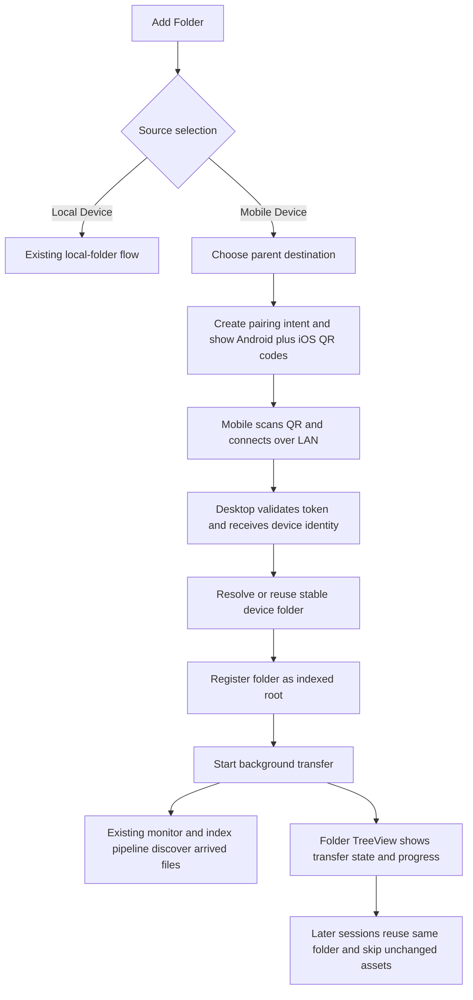

# Dev Design Spec: PC Mobile Folder

Status: Draft v0.2 (iteration 2, roadmap and schema feedback applied)

## 1. Purpose

This document defines the desktop-side design for Mobile Folder on PC, based on the desktop PRD, the mobile companion PRD, the provided UI mockups, and the mobile-folder feature roadmap.

This draft uses the roadmap as the implementation sequence when it differs from the PRD priority ordering:

- The PRD describes the end-state product behavior.
- The roadmap describes the staged delivery plan.
- The MVP section below is detailed and actionable.
- Later phases are intentionally higher level, but the MVP runtime boundaries are chosen so later phases can land without rewriting the core flow. Schema growth should happen through normal migrations when those later phases actually need new persisted state.

## 2. Current Baseline In Repo

The current desktop codebase already contains a thin UI slice for the beginning of this feature:

- `MainWindow.on_add_folder_button_click` now branches through source selection before the existing local-folder chooser.
- `MobileFolderCoordinator` exists and already remembers the last mobile destination parent in `app_config`.
- `SourceSelectionDialog` exists.
- `MobilePairingDialog` exists.
- `MobilePairingSessionDraft` already generates separate Android and iOS QR payloads with 15-minute expiry and per-platform refresh.

What is not implemented yet:

- Persistent mobile device and mobile session metadata.
- Handshake acceptance and desktop-side pairing state machine.
- Transfer transport abstraction and transfer workers.
- Stable mobile-device folder resolution and reuse.
- Folder TreeView rendering for transfer state.
- Repeat-backup dedupe rules.
- Reconnect, mismatch handling, service discovery, and stronger trust/encryption layers.

This matters because the MVP design should extend the existing slice rather than replace it.

The concrete pairing contract for this feature now lives in the dedicated [pairing spec](./[dev]%20pairing.md). When this document and the earlier mobile spec disagree on QR fields or bootstrap details, the pairing spec is the source of truth.

## 3. Guiding Design Decisions

### 3.1 Core decisions

- The desktop app remains the session authority. Mobile can request pairing and transfer, but desktop decides whether to accept the session, which folder to use, and which transport adapter is active.
- The existing `folders` plus `files` indexing pipeline stays authoritative for local search. Mobile-specific tables augment that pipeline instead of replacing it.
- Mobile transfer state must be independent from indexing state. The current `folders.status` field is not enough and should not be overloaded to represent transfer lifecycle.
- The pairing dialog is modal, but the transfer itself is non-modal. After pairing is accepted and the device folder is resolved, the folder appears in the main tree and the rest of the work continues in background threads.
- MVP trust is the minimum trust model already described in the repo notes: desktop authorizes backup based on successful QR bootstrap plus device-identity exchange. Stronger transport encryption and key rotation come later.
- MVP transport is QR bootstrap plus Wi-Fi LAN only. Initial USB transport support moves to Phase 2, while the transport interface remains ready for additional adapters.
- MVP persistence should stay intentionally small. Store only the fields required for roadmap-scoped behavior now, and add later-phase metadata through targeted migrations instead of pre-allocating unused columns.

### 3.2 Important implementation constraint

The current database bootstrap only runs `db_schema.sql` when the SQLite file does not yet exist. That is not sufficient for this feature because most existing users will already have a database.

MVP therefore needs a lightweight migration mechanism before any mobile tables ship. Without that, upgraded installs will never get the new schema.

## 4. Scope By Roadmap Phase

### 4.1 MVP

MVP on desktop covers:

- Source selection from the existing Add Folder entry point.
- Parent destination selection for mobile backups.
- Pairing-intent creation and per-platform QR generation with expiry and refresh.
- Minimum-trust pairing handshake.
- Wi-Fi LAN transfer for the paired session.
- Stable device-folder creation or reuse after desktop learns device identity.
- Registration of the resolved device folder as a normal indexed root folder.
- Background transfer into that folder while the existing incremental indexing pipeline discovers new files.
- Transfer-state visibility in the Folder TreeView.
- Repeat backup for the same device identity by transferring only new or updated assets.
- Completion, stop, and failure persistence.
- Basic desktop telemetry for operational visibility.

MVP explicitly does not require:

- Initial USB session establishment or USB transport negotiation.
- Desktop reconnect action in the tree.
- Device mismatch decision UI.
- Automatic discovery without QR.
- Mid-session transport switching.
- Strong end-to-end encryption and key rotation.

### 4.2 Phase 2

High-level additions:

- Initial USB transport adapter support behind the same session-manager interface, with Wi-Fi LAN retained as fallback.
- Desktop-driven reconnect flow from the Folder TreeView.
- Device mismatch decision dialog and UUID reassignment flow.
- Better deep-link and app-install continuity assumptions in the QR flow.
- Explicit disconnected and resumable states as user-visible actions, not just persisted metadata.

### 4.3 Phase 3

High-level additions:

- Stronger interruption handling and session recovery semantics.
- Better support for longer-running transfers and mobile-side background constraints.
- More resilient heartbeat and lease handling between desktop and mobile.

### 4.4 Phase 4

High-level additions:

- Service discovery for reconnect and resume without requiring a fresh QR scan every time.
- mDNS and dns-sd for LAN discovery, plus USB-assisted discovery paths.
- QR remains the explicit bootstrap fallback.

### 4.5 Phase 5

High-level additions:

- Stronger transport security beyond the minimum-trust MVP model.
- Session-key derivation, verification, expiry, and rotation behavior aligned with the trust-model notes.
- Failure handling for expired or rotated trust material.

### 4.6 Phase 6 (GA)

High-level additions:

- Automatic in-session preference and switchover to USB when supported and available.
- Transport handoff without restarting the desktop session.
- Final product polish around transport visibility and recovery.

## 5. MVP Detailed Design

### 5.1 MVP user-visible behavior

1. The user clicks Add Folder.
2. The desktop app shows the source-selection dialog with Local Device and Mobile Device.
3. If Local Device is chosen, the existing folder chooser flow continues unchanged.
4. If Mobile Device is chosen, the desktop app prompts for a parent destination directory.
5. The desktop app creates a pairing intent and shows the QR dialog with Android and iOS QR codes.
6. The mobile app scans the platform-specific code and connects to the desktop bootstrap endpoint.
7. The desktop validates the token, accepts the pairing, receives device identity plus device metadata, and resolves the stable local device folder.
8. The desktop inserts or reuses the resolved folder in the normal root-folder list.
9. The desktop starts receiving files into that folder in the background while the existing filesystem monitor and index pipeline process arrived files.
10. The Folder TreeView shows transfer state and progress while the rest of the app remains usable.
11. On later sessions for the same device UUID, the desktop reuses the same folder and skips unchanged assets.

### 5.2 MVP scope reconciliation

The desktop PRD describes USB preference, reconnect, mismatch handling, and richer recovery as P0 behavior. The roadmap stages those pieces later.

This draft follows the roadmap split:

- MVP uses QR bootstrap plus Wi-Fi LAN transfer only.
- MVP surfaces transfer state in the tree now.
- Phase 2 adds initial USB transport support, reconnect actions, and mismatch resolution UI.
- Later phases add discovery, stronger transport security, and automatic transport handoff.

### 5.3 MVP runtime architecture

#### A. UI entry layer

- `MainWindow.on_add_folder_button_click`
- `MobileFolderCoordinator`
- `SourceSelectionDialog`
- `MobilePairingDialog`

Responsibility:

- Own only immediate user interaction and orchestration handoff.
- Do not own long-running transfer state.

#### B. Pairing-intent layer

New desktop responsibility:

- Keep a pairing intent alive for the currently open QR dialog.
- Track per-platform tokens, expiry, refresh generation, and whether a token has been consumed.

The current in-memory `MobilePairingSessionDraft` is a good starting point, but MVP should move ownership out of the dialog and into a coordinator or service so expiry and refresh are not UI-local. Database persistence is not required in MVP because an unaccepted pairing intent can be discarded when the dialog closes or the app exits.

#### C. Session manager layer

New component proposed for MVP:

- `MobileTransferSessionManager`

Responsibility:

- Keep an in-memory registry of active desktop mobile sessions.
- Enforce one active session per device UUID.
- Own transition rules between `awaiting_pairing`, `transferring`, `transfer_completed`, and `failed`.
- Publish thread-safe progress updates onto the UI layer, preferably through Qt signals or the existing event bus.

#### D. Transport adapter layer

New abstraction proposed for MVP:

- `MobileTransportAdapter`

Concrete adapters over time:

- `LanTransportAdapter` for MVP.
- `UsbTransportAdapter` added behind the same interface in Phase 2.
- Automatic transport handoff layered on later.

Responsibility:

- Accept or establish the desktop-side transport channel.
- Deliver a normalized stream of session messages plus file payloads to the session manager.
- Keep transport details out of UI code and folder/indexing code.

#### E. File-write layer

New component proposed for MVP:

- `MobileTransferWorker`

Responsibility:

- Consume normalized asset-transfer commands.
- Resolve target path inside the device folder.
- Stream bytes into a temporary file, then atomically rename into place.
- Apply timestamps and record transfer metadata.
- Emit counters and failure reasons.

#### F. Folder/index integration layer

Use the existing indexing stack instead of building a separate mobile indexing path.

Responsibility:

- Register the resolved device folder as a normal root folder.
- Reuse filesystem monitoring and incremental indexing.
- Keep search and browse behavior unchanged once files exist on disk.

This is the lowest-risk integration path and preserves the current search architecture.

### 5.4 MVP desktop data model

The current tables remain part of the solution:

- `folders`: authoritative list of indexed root folders.
- `files`: authoritative list of indexed files.
- `app_config`: still stores last selected destination parent.

MVP adds only the mobile-specific tables required by the roadmap-scoped desktop behavior. Future reconnect, USB, discovery, and stronger trust work should extend the schema through targeted migrations instead of pre-allocating unused MVP columns.

#### A. `mobile_devices`

Purpose:

- One row per logical mobile device identity.

Minimum fields:

- `device_uuid` TEXT PRIMARY KEY
- `platform` TEXT NOT NULL
- `device_name` TEXT NOT NULL

#### B. `mobile_folders`

Purpose:

- Attach mobile-specific metadata to a normal root folder.

Minimum fields:

- `folder_id` INTEGER PRIMARY KEY REFERENCES folders(id)
- `device_uuid` TEXT UNIQUE NOT NULL REFERENCES mobile_devices(device_uuid)
- `transfer_state` TEXT NOT NULL
- `transfer_state_updated_at` TIMESTAMP NOT NULL

Notes:

- `folders.path` remains authoritative for the selected parent plus resolved device-folder path.
- Folder display text should be derived from `folders.path` plus `mobile_devices.device_name` instead of being duplicated here.

#### C. `mobile_backup_sessions`

Purpose:

- Persist one row per desktop-side backup attempt.

Minimum fields:

- `session_id` TEXT PRIMARY KEY
- `device_uuid` TEXT NOT NULL REFERENCES mobile_devices(device_uuid)
- `folder_id` INTEGER NOT NULL REFERENCES folders(id)
- `status` TEXT NOT NULL
- `started_at` TIMESTAMP NOT NULL
- `paired_at` TIMESTAMP
- `ended_at` TIMESTAMP

Notes:

- `status` must distinguish active, completed, stopped_by_mobile, and failed.
- MVP does not need separate `transport`, `failure_message`, or aggregate-count columns because active progress lives in the in-memory session manager and terminal outcome lives in `status`.

#### D. `mobile_assets`

Purpose:

- Persist per-device asset history for repeat backup and future mismatch handling.

Minimum fields:

- `device_uuid` TEXT NOT NULL REFERENCES mobile_devices(device_uuid)
- `remote_asset_id` TEXT NOT NULL
- `remote_asset_version` TEXT
- `local_relative_path` TEXT NOT NULL
- `last_transferred_at` TIMESTAMP NOT NULL
- PRIMARY KEY (`device_uuid`, `remote_asset_id`)

Notes:

- MVP repeat-backup skip rules can use `remote_asset_id` plus `remote_asset_version` without requiring desktop-side hashing for every file.
- Content-hash columns can be added later if mismatch recovery needs content-level dedupe.
- The desktop should store local relative path, not absolute path, so folder relocation logic is simpler later.

### 5.5 MVP filesystem layout

Device folders should be created as:

- `<selected parent>/<resolved device folder>/<YYYY-MM>/<filename>`

Rules:

- `resolved device folder` is derived from the mobile device name plus platform, with collision-safe suffixing when siblings would conflict.
- `YYYY-MM` uses asset update date when provided, otherwise capture date, otherwise creation date.
- A transferred file is first written to a temporary file in the target month directory and then renamed into the final path.
- If an asset has already been recorded for the same device UUID with the same remote version, skip transfer.
- If the target filename already exists but the incoming asset is new or changed, create a conflict-safe name rather than overwrite.
- Original timestamps should be applied when the source metadata makes that possible.

### 5.6 MVP transfer-state model

The Folder TreeView should support these mobile transfer states immediately:

- `awaiting_pairing`
- `transferring`
- `transfer_completed`
- `failed`

`disconnected` should be persisted in the schema from day one, but it does not need a user-invokable reconnect action until Phase 2.

Reasoning:

- Persisting the PM-required canonical states now is enough for TreeView status and later reconnect eligibility.
- Holding back the explicit reconnect UI and USB transport support keeps MVP aligned with the staged roadmap.

### 5.7 MVP Folder TreeView design

The current tree view uses the default item presentation. That is not sufficient for the provided UI mockup.

MVP should therefore introduce:

- Extra item roles for root-folder metadata.
- A custom `QStyledItemDelegate` for mobile root rows.

Recommended additional item roles:

- `folder_kind`: `local` or `mobile`
- `mobile_device_label`
- `mobile_transfer_state`
- `mobile_subtitle`
- `mobile_progress_current`
- `mobile_progress_total`

Rendering behavior:

- Local folders continue to render close to the current style.
- Mobile root folders show the device label, state badge, and one secondary line of status text.
- During transfer, a thin progress bar can be painted beneath the subtitle.
- Selecting a mobile root folder should still load images from the on-disk device folder through the existing browse flow.

Context menu behavior in MVP:

- Keep `Remove Folder`.
- Do not expose `Reconnect` yet.
- Reserve the role and action wiring for Phase 2.

### 5.8 MVP pairing and transfer handshake

The concrete MVP pairing handshake is defined in the dedicated [pairing spec](./[dev]%20pairing.md).

Desktop-specific summary:

- QR payload is now a universal-link-style URL carrying only `v`, `ept`, `sid`, and `opt`, where `ept` can hold up to five filtered LAN endpoint targets for the same pairing port.
- Desktop exposes a live local HTTP bootstrap endpoint while the pairing dialog is open.
- Desktop validates the request, derives trust material, persists device plus folder metadata, and returns the accepted session metadata to mobile.

See the pairing spec for the request and response bodies, sequence diagram, and the rationale for keeping the QR bootstrap contract to a 6-digit `opt` plus session metadata and a small list of candidate LAN endpoints.

### 5.9 MVP repeat-backup behavior

For the same device UUID:

- Reuse the same row in `mobile_devices`.
- Reuse the same row in `mobile_folders` and the same indexed root folder on disk.
- Transfer only assets that are new or whose `remote_asset_version` differs from the last transferred version.

For MVP, the user may still enter repeat backup through the normal Add Folder -> Mobile Device flow again. That keeps the UI surface smaller while still delivering repeat-backup semantics.

This is intentionally simpler than the future reconnect flow.

### 5.10 MVP integration with existing code paths

The likely implementation surface is:

- `dt_image_search/__main__.py`
- `dt_image_search/mobile/mobile_folder_controller.py`
- `dt_image_search/mobile/mobile_dialogs.py`
- `dt_image_search/mobile/mobile_pairing_session.py`
- `dt_image_search/browse/BrowseController.py`
- `dt_image_search/base/FolderTreeModel.py`
- `dt_image_search/model/dts_db.py`
- `dt_image_search/model/db_schema.sql`

Probable new modules:

- `dt_image_search/mobile/mobile_session_manager.py`
- `dt_image_search/mobile/mobile_transfer_worker.py`
- `dt_image_search/mobile/mobile_repository.py`
- `dt_image_search/mobile/mobile_transport.py`
- `dt_image_search/view/mobile_folder_tree_delegate.py`

Important integration rule:

- Do not duplicate root-folder registration logic in multiple places.

The mobile flow should eventually reuse or extract the folder-registration behavior that today lives inside `BrowseController.on_folder_added`, instead of creating a second parallel code path that also inserts into `folders`, starts index workers, and registers filesystem monitoring.

### 5.11 MVP telemetry

Desktop telemetry should use the existing telemetry client and remain content-safe.

Recommended event coverage:

- pairing dialog opened
- QR token refreshed
- pairing accepted
- pairing rejected
- transfer started
- transfer completed
- transfer failed
- transfer stopped by mobile

Desktop telemetry must not include:

- filenames
- full paths
- raw media metadata
- device display names
- asset IDs

Allowed dimensions:

- platform bucket
- transport type
- success or failure category
- duration bucket
- count bucket

### 5.12 MVP testing plan

Minimum validation for the desktop slice:

- Unit tests for pairing-token expiry and refresh behavior.
- Unit tests for device-folder naming and collision handling.
- Unit tests for migration creation on an existing SQLite file.
- Manual validation of source selection, QR expiry, successful first backup, repeat backup, stop, and failure paths.

## 6. Phase 2 Design Direction

Phase 2 should build on the MVP tables and runtime manager rather than replacing them.
If reconnect or USB support truly needs additional persisted metadata, Phase 2 should add it with a focused migration instead of retrofitting speculative MVP columns.

Primary additions:

- Add initial `UsbTransportAdapter` support behind the same session-manager interface, while keeping Wi-Fi LAN as fallback.
- Add `Reconnect` to the mobile-folder context menu.
- Let a stored `mobile_folders` row reopen a fresh pairing or reconnect dialog without re-adding the folder.
- Add device mismatch decision handling that updates `mobile_devices` and `mobile_assets` intentionally instead of implicitly.
- Promote `disconnected` from a persisted internal state to a user-visible resumable state.

## 7. Phase 3 Design Direction

Phase 3 should harden long-running sessions rather than changing the object model.

Primary additions:

- Session heartbeats and timeout recovery.
- Better interrupted-transfer checkpointing.
- More resilient status recovery after desktop restart or abnormal exit.

## 8. Phase 4 Design Direction

Phase 4 should add discovery on top of the same session manager and device registry.

Primary additions:

- LAN discovery through mDNS or dns-sd.
- USB-assisted discovery hooks.
- QR as fallback rather than as the only path.

## 9. Phase 5 Design Direction

Phase 5 should upgrade transport security without changing the folder/index integration.

Primary additions:

- Verified key exchange.
- Expiring transport keys.
- Rekey or trust-reset behavior on reconnect.

## 10. Phase 6 Design Direction

Phase 6 should add automatic in-session transport preference and handoff on top of the Phase 2 adapter set.

Primary additions:

- Detect available USB channel during an active session.
- Seamlessly prefer or switch to USB when policy allows.
- Keep session ID and on-disk target stable across handoff.

## 11. Open Questions For Next Iteration

These are the main places where I want explicit feedback before writing the next, lower-level draft:

1. For repeat backups in MVP, is re-entering through Add Folder -> Mobile Device acceptable, or do you want the spec to pull the desktop reconnect action into MVP despite the current roadmap split?
2. Do you want the next draft to go deeper on the protocol contract between mobile and desktop, or on the file-by-file implementation plan inside the current Python codebase first?
