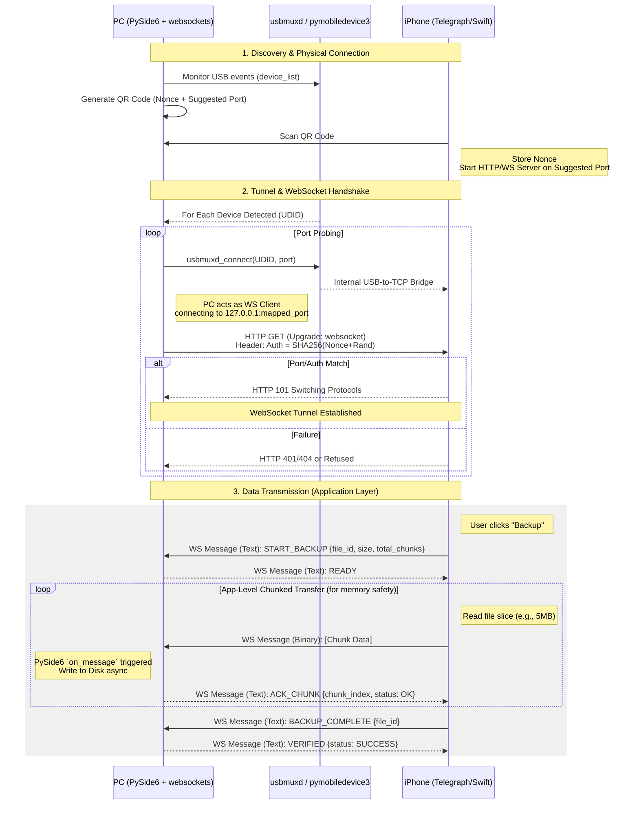

```mermaid
sequenceDiagram
    participant PC as PC (PySide6 + websockets)
    participant US as usbmuxd / pymobiledevice3
    participant iOS as iPhone (Telegraph/Swift)

    Note over PC, iOS: 1. Discovery & Physical Connection
    PC->>US: Monitor USB events (device_list)
    PC->>PC: Generate QR Code (Nonce + Suggested Port)
    iOS->>PC: Scan QR Code
    Note right of iOS: Store Nonce<br/>Start HTTP/WS Server on Suggested Port

    Note over PC, iOS: 2. Tunnel & WebSocket Handshake
    US-->>PC: For Each Device Detected (UDID)
    loop Port Probing
        PC->>US: usbmuxd_connect(UDID, port)
        US-->>iOS: Internal USB-to-TCP Bridge
        Note right of PC: PC acts as WS Client<br/>connecting to 127.0.0.1:mapped_port
        PC->>iOS: HTTP GET (Upgrade: websocket)<br/>Header: Auth = SHA256(Nonce+Rand)
        alt Port/Auth Match
            iOS-->>PC: HTTP 101 Switching Protocols
            Note over PC, iOS: WebSocket Tunnel Established
        else Failure
            iOS-->>PC: HTTP 401/404 or Refused
        end
    end

    Note over PC, iOS: 3. Data Transmission (Application Layer)
    rect rgb(240, 240, 240)
    Note right of iOS: User clicks "Backup"
    iOS->>PC: WS Message (Text): START_BACKUP {file_id, size, total_chunks}
    PC-->>iOS: WS Message (Text): READY
    
    loop App-Level Chunked Transfer (for memory safety)
        Note right of iOS: Read file slice (e.g., 5MB)
        iOS->>PC: WS Message (Binary): [Chunk Data]
        Note left of PC: PySide6 `on_message` triggered<br/>Write to Disk async
        PC-->>iOS: WS Message (Text): ACK_CHUNK {chunk_index, status: OK}
    end

    iOS->>PC: WS Message (Text): BACKUP_COMPLETE {file_id}
    PC-->>iOS: WS Message (Text): VERIFIED {status: SUCCESS}
    end
```