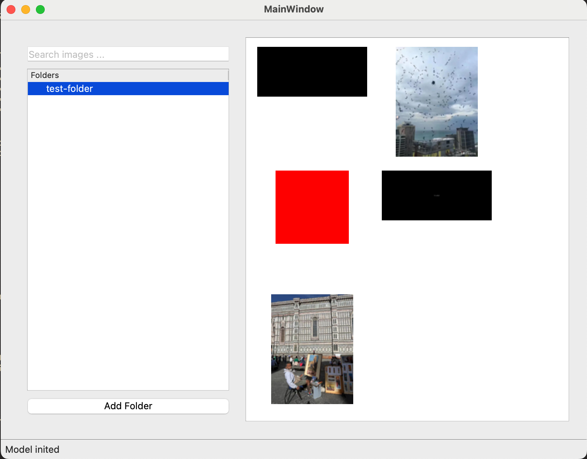

## Product Overview
This image search app features a local image indexing and search engine built with OpenCLIP and FAISS, wrapped in a PySide6 desktop application. It allows users to quickly find images on their local machine based on visual similarity. Basic image viewing and management features are included.
### The main UI components are:
- **Folder Tree View**: Displays list of folders being indexed.
    - Bottom of the view has an "Add Folder" button to select new folders for indexing.
    - [TODO] Each folder node can show a progress bar during indexing.
- **Search Bar**: Allows users to enter text queries or upload an image for search.
- **Image Grid View**: Shows thumbnails of images in the selected folder.
- **Search Results View**: Displays images similar to the search query, ranked by relevance.
- **Image Detail View**: Displays a larger preview and metadata of the selected image.

### Screenshots
- main window with folder tree / search bar / image grid

