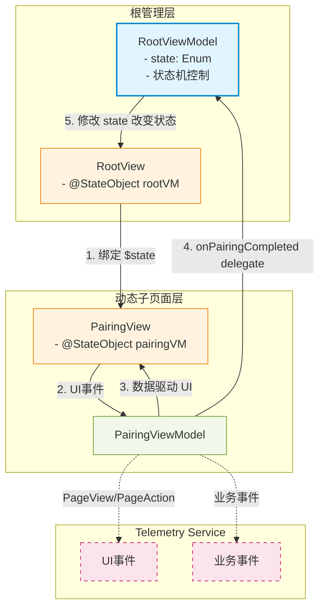

# **AuBackup (iOS)**

This iOS project implements the AuBackup app, which offers mobile album backup to PC and instant sharing features.
For specs on backup feature, see [AuBackup Specs](../../dt_image_search//specs/).
For specs on sharing feature, see [AuShare Specs](../../openspec/).

## **1\. Architecture and State Management**

Taking pairing page as a example, this is the recommended architecture and state management pattern for the iOS app, which emphasizes clear separation of concerns, centralized state machine implementation, and testability. This architecture is already implemented in the mobile/ios project (separate state machines for backup feature and instant sharing feature), and should be followed for all new features and pages.

Proper state flow is critical in SwiftUI to prevent unexpected UI behavior and performance bottlenecks.

| Guideline | Agent Guidance   |
| :---- | :---- |
| **MVVM or Composable Architecture** | Prefer MVVM (Model-View-ViewModel) design pattern. Keep Views "dumb" and move business logic into the ViewModel or a separate Domain layer. |
| **Single Source of Truth** | Use @State for local private view state, @Binding for passing state down, and @StateObject / @ObservedObject for external data sources. |
| **Observable Macro** | For iOS 17+, prioritize the @Observable macro over ObservableObject to benefit from more granular view updates. |

## **2\. SwiftUI View Best Practices**

* **Atomic Views:** Break down large views into smaller, reusable components. If a body exceeds 30-40 lines, extract subviews.  
* **Avoid View Composition in body:** Move complex conditional logic or sub-view generation into separate computed properties or helper functions.  
* **Preview Driven Development:** Always provide \#Preview blocks with mock data to ensure components are testable in isolation.  
* **Layout Safety:** Always respect the Safe Area and use Spacer(), HStack, VStack, and ZStack intentionally for adaptive layouts.

### **Example: Subview Extraction**

`// Preferred: Clear, extracted subviews`  
`struct ProfileView: View {`  
    `var body: some View {`  
        `VStack {`  
            `ProfileHeader()`  
            `ProfileStats()`  
            `LogoutButton()`  
        `}`  
    `}`  
`}`

## **3\. Concurrency and Data Fetching**

Utilize Swift's modern concurrency model to keep the UI responsive.

* **Async/Await:** Use async/await for network calls and asynchronous tasks instead of completion handlers.  
* **MainActor:** Ensure UI updates are always performed on the @MainActor. ViewModels should typically be marked with @MainActor.  
* **Task Modifier:** Use the .task view modifier for triggering data fetches when a view appears; it handles automatic cancellation when the view disappears.

## **4\. Performance Optimization**

* **Lazy Containers:** Use LazyVStack, LazyHStack, and LazyVGrid for large lists to ensure views are only rendered when they enter the screen.  
* **Identifiable Protocols:** Ensure models used in ForEach or List conform to Identifiable to help SwiftUI optimize identity tracking and animations.  
* **Asset Optimization:** Use SF Symbols where possible and ensure custom images are provided in @2x and @3x scales or as vectors (PDF/SVG).

## **5\. Testing in iOS**

* **Unit Test:** Run `mobile/ios/scripts/run_unit_tests.sh`. Need to ensure this script runs sucessfully after making changes to the iOS codebase. 
* **Snapshot Testing:** Run `mobile/ios/scripts/run_snapshot_tests.sh <record|test>`. Use record mode to update snapshots when intentional UI changes are made, and test mode to validate against existing snapshots.
